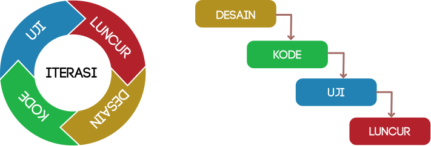
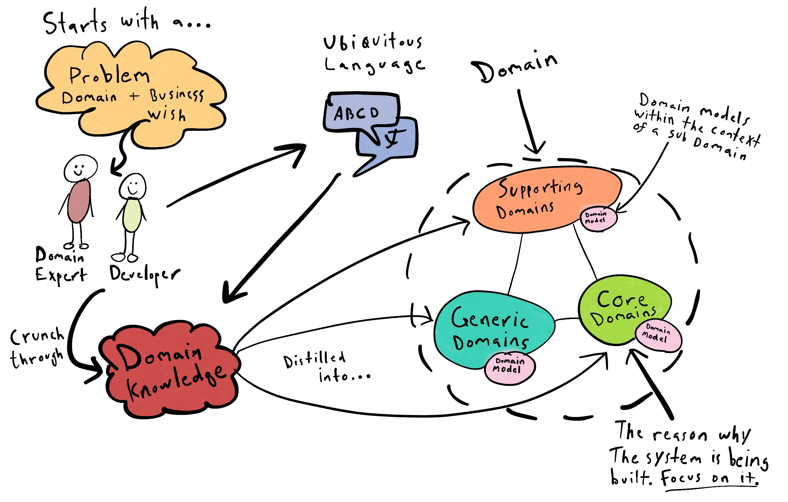
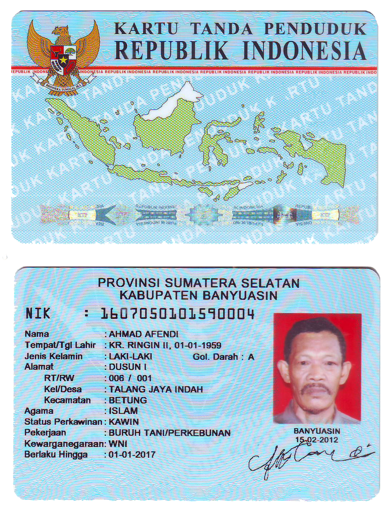
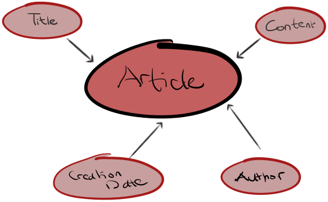

== Dasar Rekayasa Perangkat Lunak.

> Any fool can write code that a computer can understand. Good programmers write code that humans
> can understand. -- Martin Fowler

Di modul ini kita akan membahas secara singkat tentang rekayasa perangkat lunak. Rekayasa
perangkat lunak lebih dari sekadar menulis program. Rekayasa perangkat lunak adalah menerjemahkan
__requirement__ menjadi perangkat lunak. Dalam rekayasa perangkat lunak ini ada beberapa praktik
yang akan kita lakukan yaitu:

Desain dan Analisis Berorientasi Objek:: Yaitu metode di mana kita memecahkan masalah dengan
mendefinisikan entitas-entitas dalam perangkat lunak tersebut dan perilakunya (__behaviour__).
Domain Driven Design:: Kita akan mendesain perangkat lunak dengan mendefinisikan masalah lalu
dicarikan solusinya dengan cara mengidentifikasi __domain__, __bounded context__, dan __ubiquitous
language__ untuk mencari __behaviour__, __rules__, dan __edge cases__ dari entitas-entitas tadi.
Refactoring:: Metode mengubah perangkat lunak secara terus menerus dengan menyesuaikan dengan pasar
dan juga arah perusahaan dan tim.
Test Driven Development:: Menggunakan pengujian untuk mendorong pengembangan perangkat lunak. Setiap
perubahan penting dalam perangkat lunak harus ditulis tesnya.

=== Langkah-langkah dalam pembuatan perangkat lunak

Pembuatan perangkat lunak dijalankan dengan mengikuti sebuah langkah-langkah. Dalam sebuah perusahaan
biasanya __requirement__ sebuah perangkat lunak dijalankan dengan metode
link:https://en.wikipedia.org/wiki/Agile_software_development[__Agile__].  Dalam metode __Agile__,
__requirement__ dibuat dalam iterasi. Berbeda dengan metode
link:https://en.wikipedia.org/wiki/Waterfall_model[__Waterfall__], di mana perangkat lunak
dibuat melalui fase.

.Agile vs Waterfall

=== __Requirement__ Perangkat Lunak

Untuk perangkat lunak kali ini kita punya akan membuat sebuah __article manager__ dengan
__requirement__ sebagai berikut: Perangkat lunak yang akan kita bangun adalah sebuah server blog.
Dalam blog tersebut user bisa membuat, melihat artikel-artikel yang ada, serta menyunting
artikel-artikel tersebut.

==== Pembuatan User Stories

Dari __requirement__ di atas bisa diturunkan beberapa __user stories__. __User Stories__ adalah
sebuah deskripsi informal dari __behaviour__ perangkat lunak yang dibangun. Dari user stories inilah
nantinya entitas akan dideduksi dan diturunkan. __User story__ biasanya ditulis dengan template.

.Contoh Story Dalam Bahasa Inggris
[example]
As A **[aktor]** I want to **[kegiatan]** so that **[hasil yg diinginkan]**.

Atau kalau diterjemahkan menjadi Bahasa Indonesia, kurang lebih

.Contoh Story Dalam Bahasa Indonesia
[example]
Sebagai **[aktor]** saya ingin **[kegiatan]** sehingga **[hasil yang diinginkan]**.

Dari __requirement__ di atas, kita bisa turunkan beberapa __user stories__ sebagai berikut.

[cols="1,2,5,8"]
.**User Stories** untuk aplikasi blog
|===
| No |Sebagai | saya ingin | sehingga

| 1
| Penulis
| menambahkan artikel baru
| artikel tersebut bisa dibaca oleh pembaca

| 2
| Penulis
| menyunting artikel saya
| artikel yang baru bisa dibaca oleh pembaca

| 3
| Pembaca
| melihat judul semua artikel yang ada
| saya bisa memilih artikel mana yang mau dibaca

| 4
| Pembaca 
| memilih satu artikel
| saya bisa membaca satu artikel tersebut

|===

=== __Domain Driven Design__

__Domain Driven Design__ adalah metode membuat perangkat lunak dengan menjadikan struktur perangkat
lunak seperti nama variabel dan nama objek selaras dengan domain bisnisnya. Yang mungkin dengan
mudah diilustrasikan seperti di bawah ini.

.Ilustrasi DDD

Pembuatan dimulai dari masalah dulu yang dibicarakan dengan bahasa yang sama (__Ubiquitous
Language__) untuk mendapatkan pemahaman yang serupa akan domainnya. Dari pemahaman itu dicarilah
Domainnya.  

==== Mengidentifikasi **Domain** dan **Batasan Konteks**

Satu istilah bisa mempunyai banyak konteks. Misalnya istilah **pelanggan**. Untuk domain seperti
__e-commerce__, istilah **pelanggan** artinya akan berbeda untuk konteks **pembayaran** dan
**pengiriman**. Untuk perangkat lunak yang akan kita bikin hanya ada satu konteks dan satu domain
yaitu **penulisan artikel**. 

==== Mengidentifikasi Istilah

Daftar istilah penting untuk media komunikasi antara pengembang dan __domain expert__. Dari
__requirement__ yang kita sudah dapatkan di atas kita bisa mengembangkan beberapa istilah sebagai
berikut:

[cols="1,1,4"]
.Daftar Istilah Untuk Domain Blog
|===
| Bhs. Indonesia | Bhs. Inggris | Definisi 

| Pembaca | Reader | Orang yang membaca artikel 
| Penulis | Writer | Orang yang menulis artikel
| Artikel | Article | Sesuatu yang dibaca

|===

==== Mengidentifikasi Entitas dan __Value Object__

Hal selanjutnya yang akan kita identifikasi adalah **entitas** dan **__value objects__**. Entitas dan
__value object__ berperan sentral dalam pembuatan perangkat lunak dengan metode __Domain Driven
Design__.

[cols="1,2,3"]
.Entitas dan Value Object
|===
| Istilah | Contoh & Ilustrasi | Deskripsi

| **Entitas**
| 
| Sesuatu yang mempunyai **identitas**. Kesamaan antar entitas adalah dari identitasnya. 

Indikator
yang biasa terlihat ketika objek tersebut mempunya **ID** atau mempunyai **status**. Dengan
keberadaan status, artinya objek tersebut mempunyai __state__ dan __lifecycle__. Semua yang
mempunyai __state__ dan __lifecycle__ adalah entitas.

NIK dalam eKTP adalah **identitas** dan data-data di dalamnya adalah **__state__**. Data di dalamnya
bisa berubah kapanpun, tetapi ktp tersebut merujuk ke orang yang sama karena **NIK nya sama**.

| **Value Object** 
|  
| Sesuatu yang menyimpan kumpulan nilai. Kesamaan antar __value objects__ adalah kesamaan 
dari **semua nilai**nya. 

Perbedaan mencolok antara entitas dan __Value object__ tidak mempunyai __lifecycle__.

Dua lembar uang dengan nilai yang sama misalnya **£100.00 dan Rp100,00**. Walaupun mempunyai angka
yang sama (dua-duanya seratus) tetapi karena mata uangnya lain, yaitu Pound Sterling dan Rupiah, dua
nilai tersebut tidak sama.  

|===

Sebuah objek diklasifikasikan dalam entitas atau value object **tergantung dengan konteksnya**.
Contohnya soal uang. Jika hanya dilihat nilainya, maka dia adalah __value object__, tetapi
ketika membangun perangkat lunak untuk memanajemen uang kertas yang beredar di masyarakat di mana
tiap lembar uang kertas ada identitasnya berupa nomor seri, maka uang adalah entitas.

Dari analisis __user story__ di atas kita bisa tulis daftar objek lalu kita identifikasi apa saja
yang menjadi entitas dan __value object__nya.

[.text-center]
.Entitas dan Value Object dari artikel

[cols="1,3,1"]
.Objek-objek yang diidentifikasi dari domain blog
|===
| Nama objek | Deskripsi | Jenis objek

| __Article__ | Representasi dari artikel yang ditulis dan dibaca | Entitas
| __Author__ | Nama dan alamat email dari orang yang menulis artikel | Value Object
| __Creation Date__ | Tanggal di mana article dibuat | Value Object

|===

=== Menulis kode dan pengujian

Seperti yang kita bahas di bab sebelumnya. Kegiatan analisis dan menulis kode dijalankan secara
iteratif. Artinya, selama menulis kode kita juga berkomunikasi dengan domain expert untuk
mendapatkan penjelasan lebih detail.

[NOTE]
====
Saya hanya akan mencontohkan untuk menuliskan kode untuk dua story di atas saja. Sementara
story-story selanjutnya adalah pekerjaan rumah untuk __trainee__.
====

==== Analisis __Story__

Ketika kita mendapatkan __story__, baik dari manajer produk atau pengguna langsung. Setelah kita
menentukan entitas dan __value object__, kita lanjutkan dengan menganalisa __behaviour__ dari
entitas-entitas di atas. Ada 4 hal yang harus kita tentukan yaitu:

Behaviour :: yaitu perubahan keadaan dari entitas yang terlibat. Bisa digambarkan dengan __state
transition__, dari state A ke state B.

Rules:: yaitu syarat perubahan itu terjadi, jika syarat-syarat ini tidak terpenuhi, maka state
transition tidak akan terjadi.

Edge Cases:: dari __rules__ tadi, adakah keadaan yang harus ditangani jika terjadi keadaan-keadaan
yang tidak normal. Permasalahan jaringan, data yang rusak, dan sebagainya.

[NOTE]
====
__Rules__ dan __edge cases__ ini adalah dasar untuk penetapan __acceptance criteria__.
====

Side Effects:: biasanya berhubungan dengan __state transition__ dari entitas lain. Apakah perubahan
__state__ dari entitas ini akan berpengaruh ke perubahan __state__ dari entitas lain?

[cols="1,1"]
|===
| Bahasa Indonesia | Bahasa Inggris

| Sebagai **Penulis** saya ingin **menambahkan artikel baru** sehingga **artikel tersebut bisa
dibaca oleh pembaca**.
| As a **Writer** I want to **add new article** so that **that article can be read by the reader**.
|===

Dari story di atas kita bisa analisis seperti di bawah ini.

===== Behaviour

Ketika artikel dibuat, __state__ dari artikel akan berubah dari tidak ada menjadi ada. State **ada**
ini kita akan ekspresikan dalam Bahasa Inggris sebagai `Created`.

.`Created` State Transition, dari tiada menjadi ada

[#entity_rules]
===== Rules

Ketika ada perubahan state dari tidak ada menjadi `Created` pasti ada syaratnya. Syarat ini yang
kita sebut dengan **__rules__**. Untuk entitas `Article` ini, kita punya beberapa syarat. Misalnya:

. Harus ada **judul**.
. **Judul** harus lebih dari 5 karakter.
. Harus ada **konten**.
. **Konten** minimal 10 karakter.

Jadi jika semua syarat tidak terpenuhi, objek `Article` tidak akan pernah bisa ada. Jika
syarat-syarat tersebut tidak dipenuhi tetapi `Article` nya ada berarti perangkat lunaknya **salah**
karena ada entitas yang mempunyai __invalid state__.

===== Edge Cases

Ketika ada perubahan __state__ akan selalu ada rules dan edge cases. Untuk artikel ini tidak banyak,
mungkin hanya beberapa misalnya:

[example]
Apa yang akan terjadi kalau judulnya kosong atau `nil`?

===== Side Effects

__Side effects__ atau efek samping adalah perubahan yang terjadi secara tidak langsung dari
perubahan __state__ tersebut. Saat ini, side effect dari pembuatan artikel ini adalah: pengisian
__creation date__ dengan tanggal sekarang yang akan dilakukan secara otomatis oleh aplikasi kita. 

==== Mulai Coding!

Untuk membuat kodenya, kita akan menggunakan metode yang sedikit berbeda.

. Identifikasi objek.
. Identifikasi __behaviour__.
. Identifikasi data yang dibutuhkan untuk memenuhi __behaivour__ tersebut.

===== Identifikasi objek

[source,go]
.article.go
----
type Article struct {
  // Property dan field ada di sini
}
----

`Article` ini adalah **domain object** kita yang menjadi **inti** dari perangkat lunak yang kita
buat. Mengapa fieldnya kosong? Karena kita akan mengisi field-field tersebut berdasarkan
__behaivour__ nya dahulu.

===== Identifikasi __behaviour__

__Behaviour__ pertama yaitu __creation__ atau pembuatan. Untuk membuat kita perlu sebuah fungsi untuk
mengkonstruksi struktur `Article` tadi.

[source,go]
.article.go
----
type Article struct {
  ID			uuid.UUID
  Title			string
  Content		string

  CreatedAt time.Time
}

func (a Article) IsNil() bool {
  return a.ID == uuid.Nil && len(a.Title) == 0 && len(a.Content) == 0
}

func createArticleWithID(id uuid.UUID, title, content string) (Article, error) {
  var newArticle Article
  
  newArticle = Article {
    ID:			id,
    Title:		title,
    Content:	content,
    CreatedAt:	time.Now(),
  } 
  return newArticle, nil
}

func CreateArticle(title, content string) (Article, error) {
  newId, err := uuid.NewRandom()

  if err != nil {
    return Article{}, err
  }
  return createArticleWithID(newId, title, content) 
}
----

Di situ terlihat tidak ada validasi apapun. Perangkat lunak kita masih **salah**. Di sini kita coba
lakukan identifikasi __edge cases__ dari __behaviour__ yang kita sudah definisikan. Kita
identifikasi galat yang mungkin terjadi dari syarat-syarat di bagian <<entity_rules,__rules__>> di
atas.

[source,go]
.article.go
----
var (
  ErrEmptyTitle			= errors.New("title is empty")
  ErrEmptyContent		= errors.New("content is empty")
  ErrTitleTooShort		= errors.New("title too short")
  ErrTitleTooLong		= errors.New("title too long")
  ErrContentTooShort	= errors.New("content too short")
)
----

Masing-masing __edge cases__ ini, kita tulis pengujiannya. Sebelum kita implementasi validasi sesuai
__rules__ yang sudah ditulis. Teknik yang kita pakai adalah
link:https://en.wikipedia.org/wiki/Data-driven_testing[__table driven test__^]. Kita definisikan
saja contohnya dalam variabel.

[source,go]
.article_test.go
----
  const (
  validContent = `Sollicitudin ac orci phasellus egestas tellus. Ultricies mi quis hendrerit dolor
  magna eget est lorem ipsum. Et netus et malesuada fames ac. Euismod quis viverra nibh cras
  pulvinar mattis nunc sed blandit. Aliquam vestibulum morbi blandit cursus risus at. Amet risus
  nullam eget felis eget nunc lobortis. Amet volutpat consequat mauris nunc congue nisi vitae. Sem
  viverra aliquet eget sit amet tellus cras adipiscing enim. Aliquam ultrices sagittis orci a
  scelerisque purus semper eget duis. Interdum velit laoreet id donec ultrices tincidunt.
  Sollicitudin aliquam ultrices sagittis orci a. Aliquet eget sit amet tellus. Quis enim lobortis
  scelerisque fermentum dui faucibus. Dolor sit amet consectetur adipiscing elit ut. Vulputate enim
  nulla aliquet porttitor lacus.`

  validTitle = `Lorem ipsum dolor sit amet, consectetur adipiscing elit, sed do eiusmod tempor
  incididunt ut labore et dolore magna aliqua.`

  longTitle = `et netus et malesuada fames ac turpis egestas integer eget aliquet nibh praesent
  tristique magna sit amet purus gravida quis blandit turpis cursus in hac habitasse platea dictumst
  quisque sagittis purus sit amet volutpat consequat mauris nunc congue nisi vitae suscipit tellus
  mauris a diam maecenas sed enim ut sem viverra aliquet eget sit amet tellus cras adipiscing enim
  eu turpis egestas pretium aenean pharetra magna ac placerat vestibulum lectus mauris ultrices eros
  in cursus turpis massa tincidunt dui ut ornare lectus sit amet est placerat in egestas erat
  imperdiet sed euismod nisi porta lorem mollis aliquam ut porttitor leo`
  )
----

Lalu kita tulis kode untuk pengujiannya yang isinya adalah semua __edge cases__ yang bisa
menyebabkan __state__ nya tidak valid.

[source,go]
.article_test.go 
----

func TestCreateArticle(t *testing.T) {
	// article yang dianggap nil (karena bukan pointer)
	var nilArticle Article
	require.True(t, nilArticle.IsNil())

	// id yang pasti dianggap valid
	id := uuid.MustParse("836f6aa2-ed56-437a-aee1-eff92cf4ee4d")

	validArticle, err := createArticleWithID(id, validTitle, validContent)
	require.NoError(t, err)

	// tabel test
	tests := []struct {
		// nama test
		Name string
		// input
		Title   string
		Content string
		// output
		Result Article
		Err    error
	}{
		{"EmptyTitleContent", "", "", nilArticle, ErrEmptyTitle},
		{"EmptyTitleOnly", "", validContent, nilArticle, ErrEmptyTitle},
		{"EmptyContent", validTitle, "", nilArticle, ErrEmptyContent},
		{"ShortTitle", "short", validContent, nilArticle, ErrTitleTooShort},
		{"ShortContent", validTitle, "short", nilArticle, ErrContentTooShort},
		{"TooLongTitle", longTitle, validContent, nilArticle, ErrTitleTooLong},
		{"ValidArticle", validTitle, validContent, validArticle, nil},
	}

	// Test dijalankan satu-satu dari tabel
	for _, item := range tests {
		t.Run(item.Name, func(t *testing.T) {
			article, err := createArticleWithID(id, item.Title, item.Content)
			assert.Equal(t, item.Err, err)

      if item.Err == nil {
				assert.Equal(t, item.Result.ID, article.ID)
				assert.Equal(t, item.Result.Title, article.Title)
				assert.Equal(t, item.Result.Content, article.Content)
				assert.LessOrEqual(t, time.Now().Sub(article.CreatedAt), 5*time.Second)
				assert.False(t, item.Result.IsNil())
			}
		})
	}
}
----

Jika kita jalankan pengujiannya, maka belum valid, jadi kita harus implementasikan validasinya. Dan
tentunya, kita tulis juga kode uji untuk validasinya.

[source,go]
.article.go
----

func validateTitle(title string) error {
  const minTitleLength = 10
  const maxTitleLength = 500
  
  runeCount := utf8.RuneCountInString(title)

  if runeCount == 0 {
    return ErrEmptyTitle 
  }

  if runeCount < minTitleLength {
    return ErrTitleTooShort 
  }

  if runeCount > maxTitleLength {
    return ErrTitleTooLong
  }

  return nil
}
----

[source,go]
.article_test.go 
----
func TestValidateTitle(t *testing.T) {
  tests := []struct {
    Name	string 
    Title	string
    Err		error 
  }{
    {"Empty", "", ErrEmptyTitle},
    {"TooShort", "too-short", ErrTitleTooShort},
    {"TooLong", longTitle, ErrTitleTooLong},
    {"Valid", validTitle, nil},
  }

  for _, item := range tests {
    t.Run(item.Name, func(t *testing.T) {
      assert.Equal(t, item.Err, validateTitle(item.Title))
    })
  }
}
----

[source,go]
.article.go
----
func validateContent(content string) error {
  const minContentLength = 200 

  runeCount := utf8.RuneCountInString(content)

  if runeCount == 0 {
    return ErrEmptyContent
  }

  if runeCount < minContentLength {
    return ErrContentTooShort 
  }

  return nil
}
----

[source,go]
.article_test.go
----
func TestValidateContent(t *testing.T) {
  tests := []struct {
    Name	string

    Content	string 
    Err		error
  }{
    {"Empty", "", ErrEmptyContent},
    {"TooShort", "short-content" ErrContentTooShort},
    {"Valid", validContent, nil},
  }

  for _, item := range tests {
    t.Run(item.Name, func(t *testing.T) {
      assert.Equal(t, item.Err, validContent(item.Content))
    })
  }
}
----

Setelah kita tulis dan pastikan kalau lulus uji, maka kita integrasikan saja ke fungsi
`CreateArticle` seperti di bawah ini. Kita panggil fungsi `validateTitle` dan `validateContent` ke
dalam article supaya fungsi ini **selalu** mengembalikan objek `Article` dengan __state__ yang benar.

[source%linenums,go,highlight='5-11']
.article.go
----
// .. ubah fungsi ini dengan menambahkan validasi
func createArticleWithID(id uuid.UUID, title, content string) (Article, error) {
  var newArticle Article

  if err := validateTitle(title); err != nil {
    return Article{}, err
  }

  if err := validateContent(content); err != nil {
    return Article{}, err
  }
  
  newArticle = Article {
    ID:			id,
    Title:		title,
    Content:	content,
    CreatedAt:	time.Now(),
  } 
  return newArticle, nil
}

----

Jika dijalankan kode pengujiannya, hasilnya akan berhasil. Kita sudah selesai dalam analisa dan
pembuatan __domain object__ untuk article.

=== Latihan

. Buat analisa, fungsi, dan __edge cases__ jika ingin mengedit article seperti mengganti titel atau
konten.

. Untuk kasus nomor 1 di atas tambahkan juga __side effect__ tanggal dan waktu pengeditan.

. Refaktor kode di atas dan tambahkan keterangan **penulis** (__Author__) beserta datanya. Tetap
tambahkan analisa, fungsi, dan __edge cases__ yang mungkin terjadi dengan penambahan keterangan
penulis tersebut.

