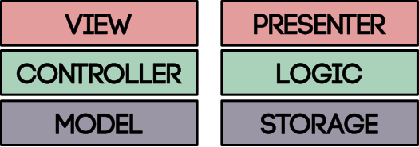
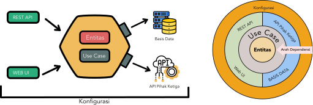

== Arsitektur Perangkat Lunak

> Good architecture makes the system easy to understand, easy to develop, easy to maintain, and easy
> to deploy. The ultimate goal is to minimize the lifetime cost of the system and to maximize
> programmer productivity. - Robert C Martin

Arsitektur Perangkat Lunak adalah pemahaman bersama tentang desain sebuah sistem. Arsitektur
perangkat lunak menunjukkan penempatan kode di lapisan atau level abstraksi tertentu.

=== Arsitektur 3 tingkat, MVC, Lasagna

Arsitektur 3 tingkat atau __three-tier architecture__ adalah arsitektur yang umum dipakai. Kita
memisahkan lapisan untuk menampilkan (__view__), logika (__logic/controller__), dan penyimpanan
(__storage/model__).

[.float-group]
--
[.left]
.Arsitektur Tiga Tingkat

Arsitektur ini sangat sederhana dan mudah dipahami. Masalah dari arsitektur ini adalah:
arsitektur ini tidak __spesifik__. Perangkat lunak apapun bisa mengklaim punya arsitektur seperti
ini.

Masalah kedua adalah, tiap lapisan dari arsitektur, **tidak bisa dideploy** secara independen. Untuk
tim yang relatif kecil atau tidak memerlukan __independent deployability__, arsitektur ini cocok
karena mudah dipahami dan koordinasi antar tim bisa dilakukan dengan cepat. Untuk sebuah
organisasi berkembang dan mempunyai __domain__ yang berkembang dan banyak, arsitektur ini akan
merepotkan karena untuk merilis satu fitur, ketiga lapisannya harus diubah, dan bisa jadi
perubahannya perlu koordinasi dengan tim lain. 
--

=== Onion / Heksagonal

Arsitektur __Onion__ atau __Heksagonal__ sedikit berbeda dengan arsitektur tiga tingakt. Arsitektur
tiga tingkat mengklaim bahwa dependensi paling ujung adalah lapisan penyimpanan atau __storage__.
Arsitektur onion dan heksagonal menempatkan __domain__ sebagai lapisan terdalam. Arsitektur ini yang
akan kita pakai di keseluruhan modul training ini.

Bentuk arsitektur onion ini banyak sekali. Robert C Martin (Uncle Bob) mendesain apa yang dia sebut
dengan __Clean Architecture__. Alistair Cockburn dengan __Hexagonal Architecture__.

.Hexagonal dan Onion

=== Pattern dan Implementasi Komponen Abstrak

==== Lapisan penyimpanan

===== Repository Pattern

===== Implementasi Repository Pattern Yang Idiomatic di Go

==== Lapisan Aplikasi

===== Protokol yang digunakan di level Aplikasi

====== HTTP

====== Protocol Buffer dan gRPC

===== Implementasi HTTP Handler Sebagai __Application Layer__

=== Latihan

